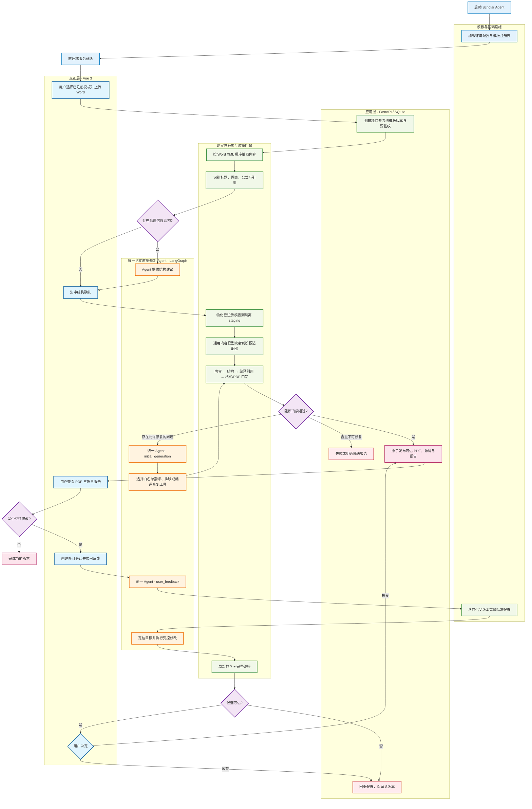

# Scholar Agent

面向中文学位论文的 Word → LaTeX 转换、格式规范检查与反馈修订系统。

Scholar Agent 将不稳定的 Word 内容抽取和结构识别，与已审核 LaTeX 模板、确定性质量门禁和受控 Agent 修订结合起来。用户可以在浏览器中选择模板、上传论文、确认结构、生成 PDF，并围绕可信版本持续提交格式反馈。

> 当前状态：可运行的工程原型。OUC 研究生与本科模板已经完成注册和端到端验证，但这不代表系统已经支持任意学校模板。

公开仓库只包含合成测试数据。真实论文、真实论文节选、模型调用记录、运行数据库和本地环境配置均不属于项目源码，禁止提交。

## 项目特点

- Word 正文、标题、图片、表格、公式、脚注、文本框、数字引用和文末参考文献的有序抽取。
- 低置信度标题集中确认，减少逐条打断用户。
- 已注册模板按 ID、版本和源指纹冻结，模板源保持只读。
- Word 内容模型与模板适配分离，同一产品流程不区分本科或研究生分支。
- 内容、结构、编译引用、格式和 PDF 多层门禁；阻断失败不会返回成功。
- 一个统一质量修复 Agent，通过识别复核、首次生成和用户反馈三种模式工作。
- Agent 使用白名单工具、有限预算、动作日志、checkpoint、事务回滚和完整终验。
- PDF、LaTeX 源码、质量报告、可信版本及用户接受/放弃闭环。

## 整体架构

架构图采用“主流程 + 决策分支 + 子系统分组”的表达方式，突出确定性工作流与 Agent 的边界。



核心原则：确定性代码负责抽取、渲染、计数、编译、门禁和版本事务；Agent 只处理规则无法充分解决的理解、规划、工具选择与反馈修订，不得绕过质量门禁或改写论文事实。

## 已完成功能

| 领域 | 当前能力 |
|---|---|
| 模板管理 | 两个固定 OUC 模板独立注册；版本、源指纹、编译配方和能力声明可追溯 |
| Word 抽取 | 段落、样式、标题、图片、复杂表格、OMML、LaTeX 公式、脚注、域、链接、文本框和引用 |
| 结构确认 | 多证据标题识别、对象绑定、低置信度 Agent 建议和一次集中确认 |
| LaTeX 生成 | 通用内容模型、模板适配器、封面占位、章节映射、Word 数字引用及文末编号列表 |
| 质量门禁 | 内容保真、结构一致性、编译返回码、PDF 新鲜度、引用完整性、缺字与基础版式检查 |
| Agent 修订 | 三种运行模式、白名单工具、LangGraph checkpoint、动作日志、幂等恢复和回滚 |
| 产品链路 | 上传、异步任务、结构确认、生成、PDF/源码/报告下载、反馈队列、接受和放弃 |
| 多模板契约 | 语言插槽、元数据字段、staging、入口、内容目录和编译配方由 Manifest/适配器驱动 |
| 测试证据 | 公开仓库提供合成单元测试、离线集成测试和前端测试；真实材料验收在私有测试环境执行 |

## 技术栈

- 后端：Python 3.11、FastAPI、SQLite、Pydantic
- Agent：LangGraph、LangChain Core、受控模型调用
- 文档处理：python-docx、lxml、pypdf
- LaTeX：XeLaTeX、BibTeX
- 前端：Vue 3、TypeScript、Vite、Pinia、Vue Router
- 测试：pytest、Vitest

## 快速开始

### 1. 环境要求

- Python 3.10+，推荐 Python 3.11
- Node.js 20.19+ 或 22.12+
- npm
- XeLaTeX 和 BibTeX；推荐安装完整 TeX Live
- Windows PowerShell、Bash 或能够执行等价命令的终端

检查环境：

```powershell
python --version
node --version
npm --version
xelatex --version
bibtex --version
```

缺少 LaTeX 工具时前后端仍可启动，但无法通过 PDF 编译门禁。

TeX Live 安装：

- Windows：从 [TeX Live 官方 Windows 安装页](https://www.tug.org/texlive/windows.html) 下载并安装，安装后重新打开终端。
- Linux：使用发行版包管理器安装完整 TeX Live，或按照 [TeX Live 官方快速安装说明](https://www.tug.org/texlive/quickinstall.html) 安装。
- macOS：安装 MacTeX；完成后确认 `xelatex` 和 `bibtex` 已加入 `PATH`。

本项目使用中文字体和 XeLaTeX，精简 TeX 发行版可能缺少模板依赖包。首次使用建议安装完整发行版。

### 2. 安装后端依赖

```powershell
git clone https://github.com/ymzaaa/Scholar-Agent.git
cd Scholar-Agent

conda create -n scholar-agent python=3.11 -y
conda activate scholar-agent
python -m pip install --upgrade pip
python -m pip install -r requirements-dev.txt
```

只运行应用时，可以安装体积更小的运行依赖：

```powershell
python -m pip install -r requirements.txt
```

复制环境变量示例：

```powershell
Copy-Item .env.example .env
```

Linux 或 macOS 可使用 `cp .env.example .env`。

在 `.env` 中填写模型供应商提供的 API Key、Base URL 和模型名。`STAGE1_DIR` 与 `SCHOLAR_WORKSPACE_ROOT` 通常不需要配置，默认目录结构会自动识别。不要提交 `.env`，也不要把密钥写入源码、测试或截图。

模型能力是可选项。配置 API Key 不等于授权外发论文内容；只有用户在具体任务中明确允许外部处理并授权对应能力时，系统才会调用模型。未配置模型时，确定性抽取、结构确认、渲染、编译和门禁仍可使用，依赖模型的歧义处理与修订功能会保持关闭。

### 3. 启动后端

在项目根目录的第一个终端中运行：

```powershell
conda activate scholar-agent
$env:PYTHONPATH = "$PWD\stage1;$PWD\backend"
python -m uvicorn backend.main:app --host 127.0.0.1 --port 8000
```

Linux 或 macOS：

```bash
PYTHONPATH="$PWD/stage1:$PWD/backend" python -m uvicorn backend.main:app --host 127.0.0.1 --port 8000
```

验证：

- 健康检查：<http://127.0.0.1:8000/health>
- OpenAPI：<http://127.0.0.1:8000/docs>

健康检查应返回：

```json
{"status":"ok"}
```

### 4. 启动前端

在第二个终端中运行：

```powershell
cd frontend
npm ci
npm run dev
```

打开 <http://127.0.0.1:5173/>。

前端默认连接 `http://127.0.0.1:8000`。如需修改后端地址：

```powershell
$env:VITE_API_BASE = "http://127.0.0.1:8000"
npm run dev
```

停止服务时在对应终端按 `Ctrl+C`。

## 基本使用流程

1. 从服务端模板目录选择已审核模板。
2. 上传 `.docx`；只有模板声明支持时才提供可选 `.bib`。
3. 等待内容抽取和结构识别。
4. 集中确认缺失字段与低置信度结构。
5. 授权或关闭可选 Agent 能力，然后生成第一版 PDF。
6. 查看 PDF、LaTeX 源码、实际问题和当前尚未覆盖的检查项。
7. 在修订页面提交格式反馈并处理候选版本。
8. 接受可信候选，或放弃并保留原版本。

## 测试

公开 Python 回归：

```powershell
conda activate scholar-agent
python -m pytest -q
```

前端测试与构建：

```powershell
cd frontend
npm test
npm run build
```

需要 LaTeX 的公开测试要求本机安装 TeX Live。真实论文、真实论文节选和真实模型验收不随公开仓库分发；维护者在独立私有测试目录中运行这些验收，且不得把输入或结果复制回公开仓库。

## 项目结构

```text
Scholar-Agent/
├── stage1/                  # Word抽取、结构识别、LaTeX渲染、模板适配、门禁与Agent内核
│   ├── agents/             # 统一质量修复Agent及三种运行模式
│   ├── adapters/           # 已注册模板的专有能力
│   ├── pipeline/           # 确定性转换、编译、报告和运行契约
│   ├── rules/              # 通用规则与模板规则画像
│   ├── template/           # 当前两个只读固定模板源
│   └── templates/          # Manifest、历史版本与审核补丁
├── backend/                # FastAPI、SQLite、异步任务、版本与反馈服务
├── frontend/               # Vue 3浏览器界面
├── tests/                  # 公开测试代码与完全合成的测试数据
│   ├── unit/              # 单元测试
│   ├── integration/       # 离线集成测试
│   ├── acceptance/        # 人工触发的合成案例验收脚本
│   ├── support/           # 构造器、假客户端与测试辅助代码
│   ├── fixtures/          # 合成 Word 和反馈输入
│   └── baselines/         # 人工审核的合成预期
├── requirements.txt
└── requirements-dev.txt
```

运行中的数据库、上传文件和 generation 产物位于自动创建的 `runtime/`，不属于源码目录，也会被 Git 忽略。

## 当前边界

- 当前只有 OUC 研究生与本科两个模板完成正式注册、基线编译和端到端验证。
- 普通用户不能上传任意 LaTeX 模板后直接进入正式转换。
- 仍有部分精确版心和 PDF 视觉规则缺少可靠自动检测器，会明确标记为能力边界。
- 任意 PDF 区域框选、长期会话约束和规则自动演进尚未完成。
- Agent 不负责改写论文观点、数据、公式含义或引用内容。
- 不承诺不同操作系统、字体环境和 TeX Live 版本生成完全相同的 PDF。

## License

项目自身代码采用 [MIT License](LICENSE)。内置模板的来源、修改范围和第三方声明见 [THIRD_PARTY_NOTICES.md](THIRD_PARTY_NOTICES.md)。学校名称和标志的相关权利归原权利人所有。
